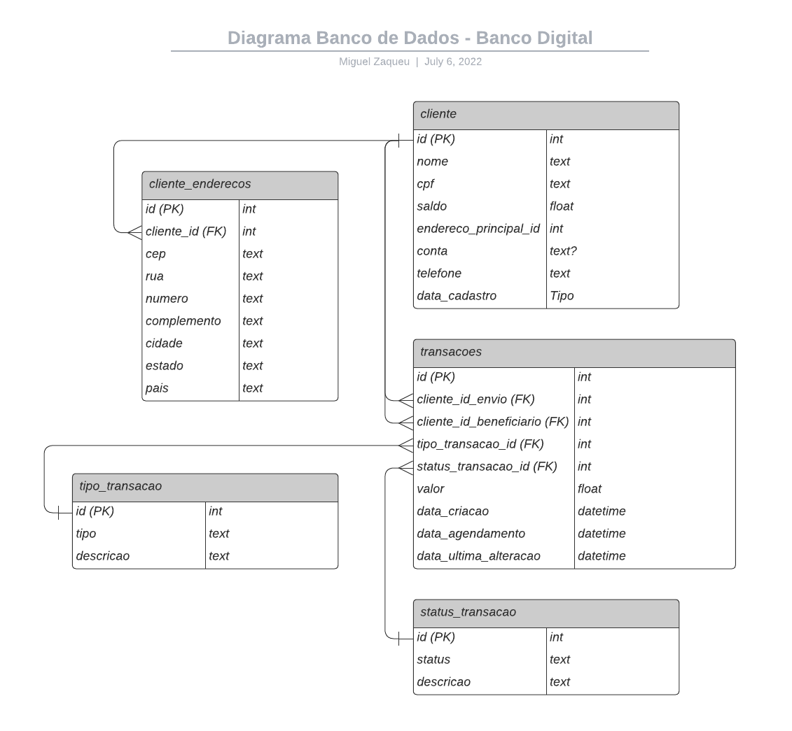

# Desafio SEMIFINAL /código[s]
<center> </center>

# 1. Desafio
Precisamos que nossos clientes possuam contas e façam transferência de valores entre
eles. A ideia é criar um sistema similar a um banco digital. Para isso, queremos criar
uma API REST, que permita:
- A criação de uma nova conta

- Consulta de todas as contas criadas
- Consulta de saldo de um conta
- Transferência de saldo entre contas
- Consulta das transferências de uma conta (Recebidos e enviados)
    - Com a possibilidade de consultar em um dado período estipulado

# 2. Planejamento da solução.
## Esboço do diagrama de relacionamentos que represente as necessidades do sistema


# 3. Solução.

## Diagrama de relacionamentos final


## Funções da API
### Cadastrar Cliente
* Endpoint(POST): /cliente/

* Campos:

| Campo | Observações |
|--- |--- |
| nome | nome do cliente |
| cpf | cpf númerico e valido (apenas passado se tipo = PF|
| cnpj | cnpj númerico e valido (apenas passado se tipo = PJ|
| email | e-mail valido do cliente|
| telefone | telefone do cliente|
| tipo | PF se pessoa física; PJ se pessoa jurídica|
<br>

* Exemplo de dados a serem enviados:

    ```python
    {
        "nome": "Juarez da Silva",
        "cpf": "23623777099"
        "email": "juarez@gmail.com",
        "telefone": "9889858849",
        "tipo": "PF"
    }
    ```
* Retorna: os dados enviados e o número da conta.

### Cadastrar Cliente Enderecos
* Endpoint(POST): /cliente_enderecos/

* Campos:
    - email: e-mail do cliente em que será adicionado o endereço
    - Exceto nulidade, essa função ainda não faz validações nos outros citados no exemplo abaixo, porém, é necessário adicionar um endereço ao cliente, pois isso libera o envio e recebimento de transacoes da conta(representaria que o cadastro está completo).

* Exemplo de dados a serem enviados:

    ```python
    {
    "cliente_id": "cliente_teste@gmail.com",
    "cep": "NA",
    "rua": "NA",
    "numero": "NA",
    "bairro": "NA",
    "complemento": "NA",
    "cidade": "NA",
    "estado": "NA",
    "pais": "NA"
    }
    ```


### Saque e Deposito (semelhantes)
* Endpoint(POST): /saque/ ou /deposito/ 

* Campos:

| Campo | Observações |
|--- |--- |
| conta_cliente | conta do cliente |
| valor | valor com no máximo duas casas decimais |

<br>

* Exemplo de dados a serem enviados:

    ```python
    {
        "conta_cliente": 100001,
        "valor": 5
    }
    ```
* Exemplo de retorno:
    ```python
    {
        "conta_cliente": "100001",
        "valor": "-5.00",
        "saldo_pre_operacao": 108.0,
        "tipo_id": "saque",
        "status_id": "finalizado"
    }
    ```

### Transferencia 
* Endpoint(POST): /transferencia/ 

* Campos:

| Campo | Observações |
|--- |--- |
| conta_cliente | conta do cliente |
| valor | valor com no máximo duas casas decimais |
| conta_implicada | conta para envio |

<br>

* Exemplo de dados a serem enviados:

    ```python
    {
        "conta_cliente": 100001,
        "valor": 5,
        "conta_implicada":100002
    }
    ```
* Exemplo de retorno:

    ```python
    {
        "conta_cliente": "100001",
        "valor": "-5.00",
        "saldo_pre_operacao": 98.0,
        "conta_implicada": "100002",
        "tipo_id": "transferencia_envio_INT",
        "status_id": "finalizado"
    }
    ```
* Observação: Esta transação gera uma transação espelho, em que representa e executa o recebimento por parte da conta de envio.

### Listagem de todas as contas
* Endpoint(GET): /conta/ 

* Retorna: Uma lista com todas as contas (e seus respectivos campos).

### Listagem de todas as contas
* Endpoint(GET): /conta/<id>

* Observação: Até o momento está usando realmente o id da conta, então se a conta for 100001, então o id é 1 (a ser alterado conforme a função a seguir).

* Retorna: Uma lista com todas as contas (e seus respectivos campos).

### Listagem de todas as transacoes de uma conta
* Endpoint(GET): /conta/<conta>/transacoes

* Observação: Podem ser passados no url, a data_maxima e/ou a data_minima (no formato YYYY-MM-DD HH:MM[:ss[.uuuuuu]][TZ]), para filtrar as transacões de acordo com a data.


* Exemplo de uso:
    - Endpoint: conta/100002/transacoes
    
        ```python
        {
            "count": 2,
            "next": null,
            "previous": null,
            "results": [
                {
                    "conta_cliente": "100002",
                    "valor": 5.0,
                    "saldo_pre_operacao": 0.0,
                    "tipo_id": "transferencia_recebimento_INT",
                    "status_id": "finalizado",
                    "conta_implicada": "100001",
                    "data_ultima_alteracao": "2022-07-17T21:25:44.710979-03:00"
                },
                {
                    "conta_cliente": "100002",
                    "valor": 10.0,
                    "saldo_pre_operacao": 5.0,
                    "tipo_id": "deposito",
                    "status_id": "finalizado",
                    "conta_implicada": null,
                    "data_ultima_alteracao": "2022-07-17T21:38:47.499510-03:00"
                }
            ]
        }
        ```

    - Endpoint: conta/100002/transacoes?data_maxima=2022-07-17T21:25:44.710979-03:00
    
        ```python
        {
            "count": 1,
            "next": null,
            "previous": null,
            "results": [
                {
                    "conta_cliente": "100002",
                    "valor": 5.0,
                    "saldo_pre_operacao": 0.0,
                    "tipo_id": "transferencia_recebimento_INT",
                    "status_id": "finalizado",
                    "conta_implicada": "100001",
                    "data_ultima_alteracao": "2022-07-17T21:25:44.710979-03:00"
                }
            ]
        }
        ```

# 4. Próximos Passos
    - Adicionar os Status e Tipos de Transação necessários, após o migrate
    - Criação de Testes
    - Validações nos campos de cliente endereço
    - Adicionar possibilidade de agendamento na transferência
    - Adicionar motivos de cancelamento