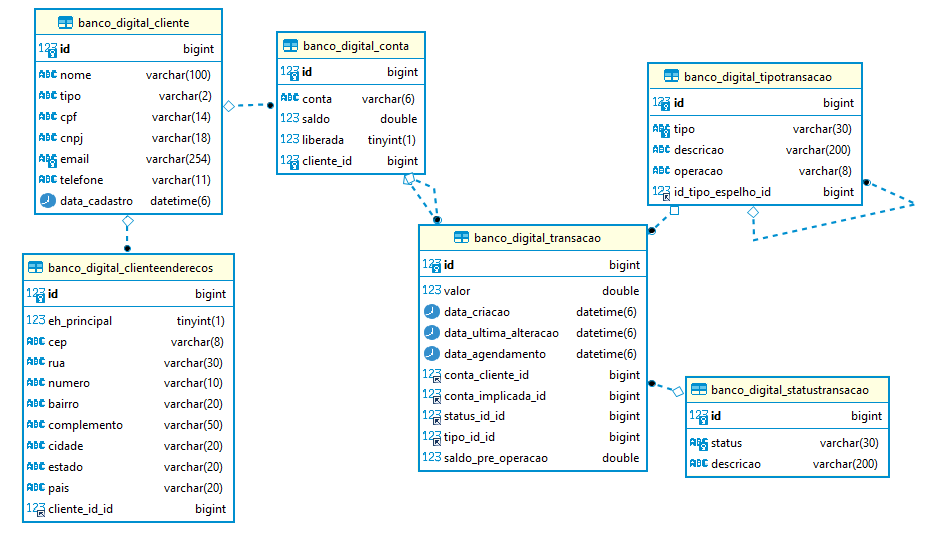

# Desafio SEMIFINAL /código[s]


# 1. Desafio.
Precisamos que nossos clientes possuam contas e façam transferência de valores entre
eles. A ideia é criar um sistema similar a um banco digital. Para isso, queremos criar
uma API REST, que permita:
● A criação de uma nova conta
● Consulta de todas as contas criadas
● Consulta de saldo de um conta
● Transferência de saldo entre contas
● Consulta das transferências de uma conta (Recebidos e enviados)
○ Com a possibilidade de consultar em um dado período estipulado

# 2. Planejamento da solução.
- Esboço do diagrama de relacionamentos que represente as necessidades do sistema


# 3. Solução.

### Diagrama de relacionamentos final


### Funções da API
#### Cadastrar Cliente
* Endpoint
* Exemplo de uso:
```python
{
    "nome": "Juarez da Silva",
    "cpf": "23623777099"
    "email": "juarez@gmail.com",
    "telefone": "9889858849",
    "tipo": "PF"
}
```

